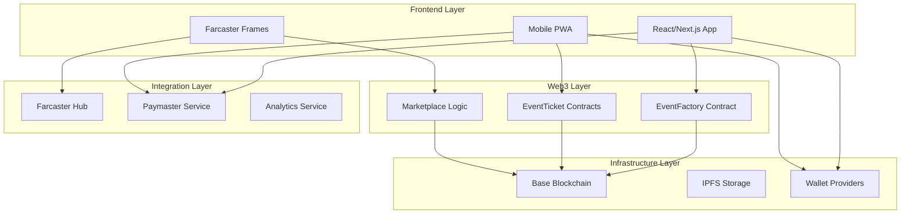
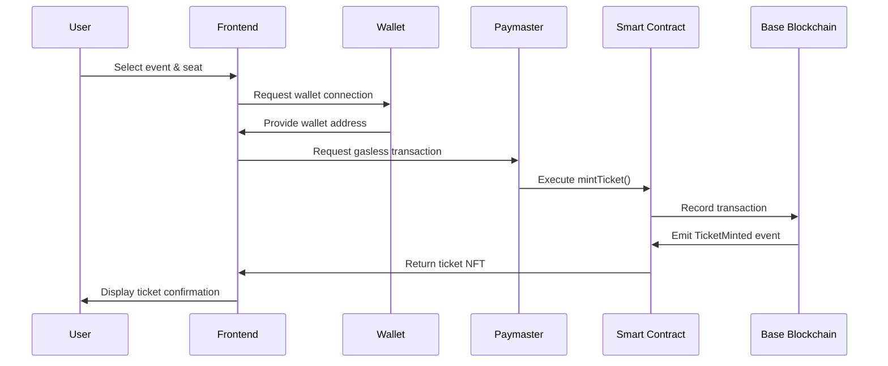
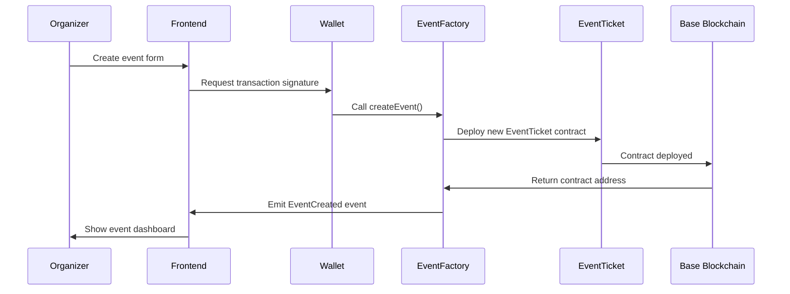

# 🏗️ EventVex System Architecture

> **High-level system design and component interactions for the EventVex platform**

## 📋 Table of Contents

- [Overview](#overview)
- [System Components](#system-components)
- [Architecture Patterns](#architecture-patterns)
- [Data Flow](#data-flow)
- [Technology Stack](#technology-stack)
- [Scalability Considerations](#scalability-considerations)
- [Security Architecture](#security-architecture)

## 🎯 Overview

EventVex is built as a decentralized, mobile-first event ticketing platform that combines blockchain technology with modern web development practices. The architecture prioritizes security, scalability, and user experience while maintaining decentralization principles.

### Core Principles

- **Decentralization First** - Smart contracts handle core business logic
- **Mobile-Optimized** - Touch-first UI with gasless transactions
- **Social Integration** - Native Farcaster Frame support
- **Developer Experience** - Comprehensive tooling and documentation
- **Security by Design** - Multi-layered security approach

## 🧩 System Components

### Component Breakdown

| Component | Purpose | Technology | Status |
|-----------|---------|------------|--------|
| **Frontend App** | Main web application | React/Next.js | 🚧 In Progress |
| **Smart Contracts** | Core business logic | Solidity | ✅ Complete |
| **Web3 Infrastructure** | Blockchain integration | Hardhat/Ethers.js | ✅ Complete |
| **Wallet Integration** | User authentication | WalletConnect/MetaMask | ✅ Complete |
| **Farcaster Frames** | Social integration | Frame SDK | 📋 Planned |
| **Mobile PWA** | Mobile experience | PWA/React | 📋 Planned |

## 🔄 Architecture Patterns

### 1. **Factory Pattern** (Smart Contracts)
- **EventFactory** creates individual **EventTicket** contracts
- Enables isolated event management and upgradability
- Reduces gas costs through contract reuse

### 2. **Component-Based Architecture** (Frontend)
- Modular React components with clear separation of concerns
- Reusable UI components with consistent design system
- State management through Context API and custom hooks

### 3. **Microservice Pattern** (Infrastructure)
- Separate services for different concerns (payments, analytics, social)
- Independent scaling and deployment
- Clear API boundaries between services

### 4. **Event-Driven Architecture** (Blockchain)
- Smart contract events drive frontend state updates
- Real-time notifications through event listeners
- Audit trail through blockchain event logs

## 📊 Data Flow

### Ticket Purchase Flow

### Event Creation Flow

## 🛠️ Technology Stack

### **Blockchain Layer**
- **Base Blockchain** - L2 Ethereum scaling solution
- **Solidity ^0.8.20** - Smart contract development
- **OpenZeppelin** - Security-audited contract libraries
- **Hardhat** - Development and testing framework

### **Frontend Layer**
- **React 18** - Component-based UI framework
- **Next.js 14** - Full-stack React framework
- **TypeScript** - Type-safe JavaScript
- **Tailwind CSS** - Utility-first CSS framework
- **Ethers.js v6** - Ethereum library for Web3 interactions

### **Development Tools**
- **Hardhat** - Smart contract development environment
- **Jest/Vitest** - Testing frameworks
- **ESLint/Prettier** - Code quality and formatting
- **Husky** - Git hooks for quality gates

### **Infrastructure**
- **Vercel** - Frontend deployment and hosting
- **IPFS** - Decentralized metadata storage
- **Base Sepolia** - Testnet for development
- **Base Mainnet** - Production blockchain network

## 📈 Scalability Considerations

### **Smart Contract Scalability**

1. **Factory Pattern Implementation**
   - Individual contracts per event reduce gas costs
   - Parallel processing of multiple events
   - Isolated failure domains

2. **Gas Optimization**
   - Efficient data structures and algorithms
   - Batch operations where possible
   - Layer 2 scaling through Base network

3. **Upgrade Strategy**
   - Non-upgradeable contracts for security
   - New versions through factory deployment
   - Migration tools for data portability

### **Frontend Scalability**

1. **Performance Optimization**
   - Code splitting and lazy loading
   - Image optimization and CDN usage
   - Caching strategies for blockchain data

2. **State Management**
   - Efficient state updates and re-renders
   - Local storage for user preferences
   - Optimistic UI updates

3. **Mobile Performance**
   - Progressive Web App (PWA) capabilities
   - Offline functionality for ticket viewing
   - Touch-optimized interactions

## 🔒 Security Architecture

### **Multi-Layer Security Approach**

1. **Smart Contract Security**
   - OpenZeppelin battle-tested libraries
   - Comprehensive test coverage (>95%)
   - Access control and role management
   - Reentrancy protection and pause mechanisms

2. **Frontend Security**
   - Input validation and sanitization
   - Secure wallet connection handling
   - XSS and CSRF protection
   - Environment variable security

3. **Infrastructure Security**
   - Private key management best practices
   - Multi-signature wallet for admin functions
   - Regular security audits and updates
   - Monitoring and alerting systems

### **Risk Mitigation**

| Risk Category | Mitigation Strategy | Implementation |
|---------------|-------------------|----------------|
| **Smart Contract Bugs** | Extensive testing + audits | 95%+ test coverage, OpenZeppelin libs |
| **Private Key Compromise** | Hardware wallets + multisig | Production deployment requirements |
| **Frontend Attacks** | Input validation + CSP | Comprehensive validation layer |
| **Network Issues** | Retry logic + fallbacks | Multiple RPC providers |
| **Gas Price Volatility** | Gasless transactions | Paymaster integration |

## 🔗 Related Documentation

- [Smart Contract Architecture](./smart-contracts.md) - Detailed contract design
- [Frontend Architecture](./frontend.md) - React application structure
- [Database Schema](./database.md) - Data models and relationships
- [Web3 Integration](../web3/README.md) - Blockchain integration details
- [Security Audit](../web3/security.md) - Security analysis and recommendations

---

**Next**: [Smart Contract Architecture](./smart-contracts.md) →
