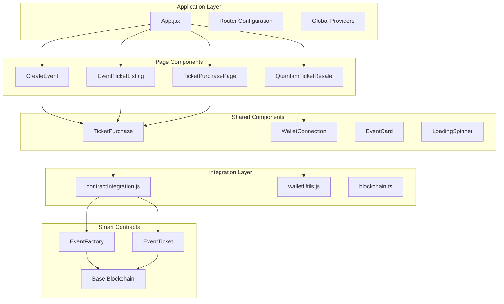

# 🎨 EventVex Frontend Architecture

> **Complete frontend architecture documentation for the EventVex React application with Web3 integration**

## 📋 Table of Contents

- [Overview](#overview)
- [Architecture Patterns](#architecture-patterns)
- [Component Structure](#component-structure)
- [Web3 Integration](#web3-integration)
- [State Management](#state-management)
- [Development Workflow](#development-workflow)
- [Performance Optimization](#performance-optimization)

## 🎯 Overview

The EventVex frontend is a modern React application built with Next.js, featuring seamless Web3 integration for blockchain-based event ticketing. The architecture prioritizes user experience, mobile responsiveness, and maintainable code while integrating complex blockchain functionality.

### Core Principles

- **Mobile-First Design** - Touch-optimized UI with responsive layouts
- **Web3 Transparency** - Blockchain complexity hidden from users
- **Component Reusability** - Modular components with clear interfaces
- **Performance Focus** - Optimized loading and smooth interactions
- **Accessibility** - WCAG AA compliance throughout

## 🏗️ Architecture Patterns

### Component Architecture



### Integration Patterns

| Pattern | Implementation | Purpose |
|---------|---------------|---------|
| **Factory Pattern** | EventFactory contract integration | Scalable event creation |
| **Provider Pattern** | Wallet connection management | Centralized Web3 state |
| **Hook Pattern** | Custom React hooks for blockchain | Reusable blockchain logic |
| **Error Boundary** | Graceful error handling | User-friendly error states |
| **Optimistic UI** | Immediate UI updates | Smooth user experience |

## 📁 Component Structure

### Page Components

#### **CreateEvent.jsx**
- **Purpose**: Event creation interface with smart contract integration
- **Integration**: EventFactory contract for event deployment
- **Features**: Form validation, wallet connection, transaction handling
- **UI Preservation**: Maintains existing form design and user flow

#### **EventTicketListing.jsx**
- **Purpose**: Event details and ticket availability display
- **Integration**: Loads events from blockchain with fallback to sample data
- **Features**: Real-time seat availability, blockchain event details
- **UI Preservation**: Existing event card design and layout

#### **TicketPurchasePage.jsx**
- **Purpose**: Ticket purchase flow for original and resale tickets
- **Integration**: Smart contract ticket minting and resale purchases
- **Features**: Seat selection, payment processing, transaction confirmation
- **UI Preservation**: Maintains purchase flow and confirmation screens

#### **QuantamTicketResale.tsx**
- **Purpose**: Ticket resale marketplace interface
- **Integration**: Resale listing and purchase functionality
- **Features**: List tickets, browse resale market, secure transactions
- **UI Preservation**: Existing marketplace design and interactions

### Shared Components

#### **TicketPurchase.jsx**
- **Purpose**: Reusable ticket purchase component
- **Integration**: Seat selection and smart contract integration
- **Props**: `eventContractAddress`, `ticketPrice`, `eventId`, `onPurchaseSuccess`
- **Features**: Available seat loading, purchase confirmation

## 🔗 Web3 Integration

### Integration Architecture

```typescript
// Core integration utilities
contractIntegration.js    // Smart contract interactions
walletUtils.js           // Wallet connection and management
blockchain.ts            // Legacy blockchain utilities (enhanced)
```

### Contract Integration Functions

#### **Event Management**
```javascript
// Create new event
const { eventId, eventContract } = await createEvent({
  name: "Event Name",
  description: "Event Description",
  date: "2024-09-01",
  venue: "Event Location",
  ticketPrice: "0.01",
  totalTickets: 100
});

// Get active events
const events = await getActiveEvents();

// Get event details
const event = await getEventDetails(eventId);
```

#### **Ticket Operations**
```javascript
// Purchase ticket
const { tokenId, txHash } = await purchaseTicket(
  eventContractAddress,
  seatNumber,
  ticketPrice
);

// List for resale
const txHash = await listTicketForResale(
  eventContractAddress,
  tokenId,
  resalePrice
);

// Buy resale ticket
const txHash = await buyResaleTicket(
  eventContractAddress,
  tokenId,
  resalePrice
);
```

#### **User Ticket Management**
```javascript
// Get user's tickets
const tickets = await getUserTickets(eventContractAddress, userAddress);

// Get ticket information
const ticketInfo = await getTicketInfo(eventContractAddress, tokenId);

// Get available seats
const availableSeats = await getAvailableSeats(eventContractAddress);
```

### Wallet Integration

#### **Connection Management**
```javascript
// Connect wallet
const { address, provider } = await connectWallet();

// Check existing connection
const address = await checkWalletConnection();

// Switch to Base Sepolia
await switchToBaseSepolia();

// Format address for display
const formatted = formatWalletAddress(address);
```

#### **Event Listeners**
```javascript
// Listen for account changes
onAccountsChanged((accounts) => {
  setWalletAddress(accounts[0]);
});

// Listen for network changes
onChainChanged((chainId) => {
  handleNetworkChange(chainId);
});
```

## 🔧 State Management

### Component State Patterns

#### **Wallet State**
```javascript
const [walletAddress, setWalletAddress] = useState('');
const [isConnected, setIsConnected] = useState(false);
const [isLoading, setIsLoading] = useState(false);
```

#### **Transaction State**
```javascript
const [isLoading, setIsLoading] = useState(false);
const [error, setError] = useState('');
const [txHash, setTxHash] = useState('');
```

#### **Event Data State**
```javascript
const [events, setEvents] = useState([]);
const [selectedEvent, setSelectedEvent] = useState(null);
const [availableSeats, setAvailableSeats] = useState([]);
```

### Error Handling Patterns

#### **User-Friendly Error Messages**
```javascript
const formatContractError = (error) => {
  if (error.message.includes('user rejected')) {
    return 'Transaction was cancelled by user';
  }
  if (error.message.includes('insufficient funds')) {
    return 'Insufficient funds to complete transaction';
  }
  if (error.message.includes('Seat is already taken')) {
    return 'This seat has already been taken. Please select another seat.';
  }
  return error.message || 'An unexpected error occurred';
};
```

#### **Loading States**
```javascript
const handlePurchase = async () => {
  setIsLoading(true);
  setError('');
  
  try {
    const result = await purchaseTicket(/* params */);
    // Handle success
  } catch (error) {
    setError(formatContractError(error));
  } finally {
    setIsLoading(false);
  }
};
```

## ⚙️ Environment Configuration

### Required Environment Variables

```env
# Smart Contract Addresses (Required after deployment)
VITE_EVENT_FACTORY_ADDRESS=0x...
VITE_PLATFORM_FEE_RECIPIENT=0x...

# Network Configuration
VITE_CHAIN_ID=84532
VITE_NETWORK_NAME=baseSepolia
VITE_RPC_URL=https://sepolia.base.org
VITE_BLOCK_EXPLORER_URL=https://sepolia.basescan.org

# Contract Configuration
VITE_PLATFORM_FEE=250
VITE_ORGANIZER_ROYALTY=500
VITE_MAX_RESALE_MULTIPLIER=300

# Feature Flags
VITE_ENABLE_GASLESS_TRANSACTIONS=true
VITE_ENABLE_FARCASTER_INTEGRATION=false
VITE_DEBUG_MODE=true
```

### Configuration Validation

```javascript
// Validate contract configuration
const isValid = await validateContractConfig();
if (!isValid) {
  console.warn('Contract configuration invalid');
}
```

## 🚀 Development Workflow

### Component Integration Process

1. **Preserve Existing UI** - No changes to component structure or styling
2. **Add Integration Imports** - Import contract utilities
3. **Update State Management** - Add blockchain-related state
4. **Integrate Contract Calls** - Replace mock data with smart contract calls
5. **Add Error Handling** - Implement user-friendly error messages
6. **Test Integration** - Verify functionality with test contracts

### Testing Strategy

#### **Component Testing**
```javascript
// Test component with mock contract integration
jest.mock('../utils/contractIntegration', () => ({
  createEvent: jest.fn(),
  purchaseTicket: jest.fn(),
  getActiveEvents: jest.fn()
}));
```

#### **Integration Testing**
```javascript
// Test with actual contract calls on testnet
const testEvent = await createEvent(testEventData);
expect(testEvent.eventId).toBeDefined();
```

## 📊 Performance Optimization

### Loading Optimization

#### **Lazy Loading**
```javascript
// Lazy load heavy components
const EventTicketListing = lazy(() => import('./EventTicketListing'));
```

#### **Data Caching**
```javascript
// Cache blockchain data
const cachedEvents = useMemo(() => {
  return events.filter(event => event.isActive);
}, [events]);
```

#### **Optimistic Updates**
```javascript
// Update UI immediately, sync with blockchain later
const handlePurchase = async () => {
  // Optimistic update
  setTicketPurchased(true);
  
  try {
    await purchaseTicket(/* params */);
  } catch (error) {
    // Revert optimistic update
    setTicketPurchased(false);
    setError(error.message);
  }
};
```

### Mobile Performance

#### **Touch Optimization**
- Minimum 44px touch targets
- Smooth scroll behavior
- Optimized animations (60fps)
- Reduced bundle size for mobile

#### **Network Optimization**
- Efficient RPC calls
- Batch blockchain queries
- Fallback to cached data
- Progressive loading

## 🔗 Related Documentation

- [Web3 Integration Guide](../web3/README.md)
- [Smart Contract API Reference](../web3/smart-contracts.md)
- [Wallet Integration Guide](./wallet-integration.md)
- [Component Library](./components.md)
- [Mobile Optimization](./mobile.md)

---

**Next**: [Wallet Integration Guide](./wallet-integration.md) →
