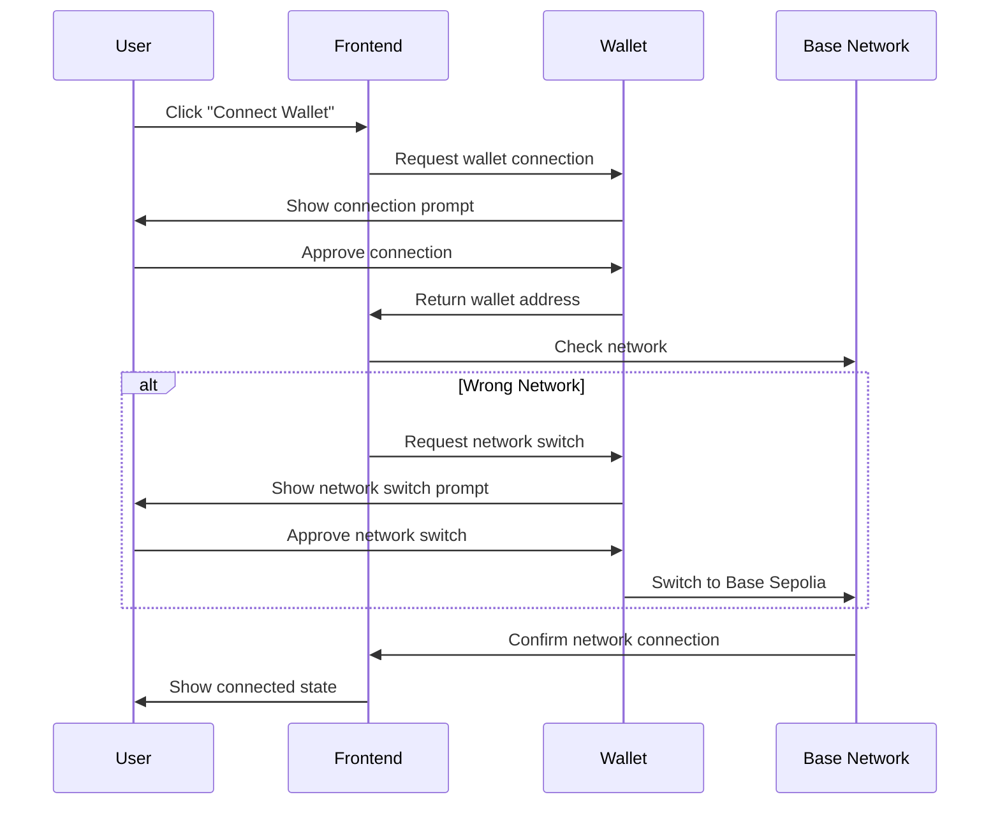

# 💼 EventVex Wallet Integration Guide

> **Comprehensive guide for wallet connection, network management, and Web3 user experience**

## 📋 Table of Contents

- [Overview](#overview)
- [Wallet Connection Flow](#wallet-connection-flow)
- [Network Management](#network-management)
- [Mobile Wallet Support](#mobile-wallet-support)
- [Error Handling](#error-handling)
- [Security Considerations](#security-considerations)
- [User Experience Patterns](#user-experience-patterns)

## 🎯 Overview

EventVex provides seamless wallet integration that abstracts blockchain complexity while maintaining security and user control. The integration supports multiple wallet providers with a focus on mobile-first experience.

### Supported Wallets

| Wallet | Desktop | Mobile | Status |
|--------|---------|--------|--------|
| **MetaMask** | ✅ | ✅ | Primary |
| **Coinbase Wallet** | ✅ | ✅ | Supported |
| **WalletConnect v2** | ✅ | ✅ | Supported |
| **Rainbow** | ✅ | ✅ | Supported |
| **Trust Wallet** | ❌ | ✅ | Supported |

### Network Support

| Network | Chain ID | Status | Purpose |
|---------|----------|--------|---------|
| **Base Sepolia** | 84532 | ✅ Active | Development & Testing |
| **Base Mainnet** | 8453 | 🚧 Ready | Production |
| **Hardhat Local** | 31337 | ✅ Active | Local Development |

## 🔄 Wallet Connection Flow

### Connection Process



### Implementation

#### **Basic Connection**
```javascript
import { connectWallet, checkWalletConnection } from '../utils/walletUtils';

const WalletConnection = () => {
  const [walletAddress, setWalletAddress] = useState('');
  const [isConnected, setIsConnected] = useState(false);
  const [isLoading, setIsLoading] = useState(false);

  // Check existing connection on mount
  useEffect(() => {
    const checkConnection = async () => {
      const address = await checkWalletConnection();
      if (address) {
        setWalletAddress(address);
        setIsConnected(true);
      }
    };
    checkConnection();
  }, []);

  // Connect wallet
  const handleConnect = async () => {
    setIsLoading(true);
    try {
      const { address } = await connectWallet();
      setWalletAddress(address);
      setIsConnected(true);
    } catch (error) {
      console.error('Connection failed:', error);
    } finally {
      setIsLoading(false);
    }
  };

  return (
    <button onClick={handleConnect} disabled={isLoading}>
      {isConnected ? formatWalletAddress(walletAddress) : 'Connect Wallet'}
    </button>
  );
};
```

#### **Advanced Connection with Network Validation**
```javascript
const handleConnectWithValidation = async () => {
  try {
    setIsLoading(true);
    
    // Connect wallet
    const { address, provider } = await connectWallet();
    
    // Ensure correct network
    await switchToBaseSepolia();
    
    // Validate contract configuration
    const isValid = await validateContractConfig();
    if (!isValid) {
      throw new Error('Smart contract configuration is invalid');
    }
    
    setWalletAddress(address);
    setIsConnected(true);
    setError('');
    
  } catch (error) {
    setError(`Connection failed: ${error.message}`);
  } finally {
    setIsLoading(false);
  }
};
```

## 🌐 Network Management

### Network Configuration

```javascript
// Network parameters for Base Sepolia
export const BASE_SEPOLIA_PARAMS = {
  chainId: "0x14a34", // 84532 in hex
  chainName: "Base Sepolia",
  nativeCurrency: {
    name: "Ethereum",
    symbol: "ETH",
    decimals: 18,
  },
  rpcUrls: ["https://sepolia.base.org"],
  blockExplorerUrls: ["https://sepolia.basescan.org"],
};

// Network parameters for Base Mainnet
export const BASE_MAINNET_PARAMS = {
  chainId: "0x2105", // 8453 in hex
  chainName: "Base",
  nativeCurrency: {
    name: "Ethereum",
    symbol: "ETH",
    decimals: 18,
  },
  rpcUrls: ["https://mainnet.base.org"],
  blockExplorerUrls: ["https://basescan.org"],
};
```

### Network Switching

#### **Automatic Network Detection**
```javascript
const ensureCorrectNetwork = async () => {
  try {
    const chainId = await window.ethereum.request({ method: 'eth_chainId' });
    const targetChainId = BASE_SEPOLIA_PARAMS.chainId;

    if (chainId !== targetChainId) {
      await switchNetwork(BASE_SEPOLIA_PARAMS);
    }
  } catch (error) {
    console.error('Network switch failed:', error);
    throw error;
  }
};
```

#### **User-Initiated Network Switch**
```javascript
const handleNetworkSwitch = async (networkParams) => {
  try {
    // Try to switch to the network
    await window.ethereum.request({
      method: "wallet_switchEthereumChain",
      params: [{ chainId: networkParams.chainId }],
    });
  } catch (switchError) {
    // If network doesn't exist, add it
    if (switchError.code === 4902) {
      await window.ethereum.request({
        method: "wallet_addEthereumChain",
        params: [networkParams],
      });
    } else {
      throw switchError;
    }
  }
};
```

### Network Status Component

```javascript
const NetworkStatus = () => {
  const [currentNetwork, setCurrentNetwork] = useState(null);
  const [isCorrectNetwork, setIsCorrectNetwork] = useState(false);

  useEffect(() => {
    const checkNetwork = async () => {
      const network = await getCurrentNetwork();
      setCurrentNetwork(network);
      setIsCorrectNetwork(network.chainId === BASE_SEPOLIA_PARAMS.chainId);
    };

    checkNetwork();

    // Listen for network changes
    if (window.ethereum) {
      window.ethereum.on('chainChanged', checkNetwork);
      return () => window.ethereum.removeListener('chainChanged', checkNetwork);
    }
  }, []);

  if (!isCorrectNetwork) {
    return (
      <div className="bg-yellow-50 border border-yellow-200 rounded-lg p-4">
        <div className="text-yellow-800">
          Please switch to Base Sepolia network
        </div>
        <button 
          onClick={() => switchToBaseSepolia()}
          className="mt-2 bg-yellow-600 text-white px-4 py-2 rounded"
        >
          Switch Network
        </button>
      </div>
    );
  }

  return (
    <div className="text-green-600 text-sm">
      ✅ Connected to {currentNetwork?.name}
    </div>
  );
};
```

## 📱 Mobile Wallet Support

### Mobile Detection and Optimization

```javascript
const isMobile = () => {
  return /Android|webOS|iPhone|iPad|iPod|BlackBerry|IEMobile|Opera Mini/i.test(
    navigator.userAgent
  );
};

const connectMobileWallet = async () => {
  if (isMobile() && !window.ethereum) {
    // Redirect to wallet app or show wallet options
    const walletUrl = `https://metamask.app.link/dapp/${window.location.href}`;
    window.open(walletUrl, '_blank');
    return;
  }
  
  // Standard connection flow
  return connectWallet();
};
```

### WalletConnect Integration

```javascript
// WalletConnect v2 integration (future enhancement)
const connectWithWalletConnect = async () => {
  // Implementation for WalletConnect v2
  // This would be added in future iterations
};
```

### Mobile UX Patterns

#### **Touch-Optimized Connection Button**
```javascript
const MobileWalletButton = ({ onConnect, isConnected, address }) => {
  return (
    <button
      onClick={onConnect}
      className="w-full min-h-[44px] bg-blue-600 text-white rounded-lg font-medium text-lg"
    >
      {isConnected ? (
        <div className="flex items-center justify-center space-x-2">
          <div className="w-2 h-2 bg-green-400 rounded-full"></div>
          <span>{formatWalletAddress(address)}</span>
        </div>
      ) : (
        'Connect Wallet'
      )}
    </button>
  );
};
```

## ❌ Error Handling

### Common Error Scenarios

#### **User Rejection**
```javascript
const handleUserRejection = (error) => {
  if (error.code === 4001) {
    return 'Connection was cancelled by user';
  }
  if (error.message.includes('user rejected')) {
    return 'Transaction was cancelled by user';
  }
  return error.message;
};
```

#### **Network Errors**
```javascript
const handleNetworkError = (error) => {
  if (error.code === 4902) {
    return 'Network not found. Please add Base Sepolia to your wallet.';
  }
  if (error.message.includes('network')) {
    return 'Network connection failed. Please check your internet connection.';
  }
  return error.message;
};
```

#### **Wallet Not Found**
```javascript
const checkWalletAvailability = () => {
  if (!window.ethereum) {
    if (isMobile()) {
      return {
        available: false,
        message: 'Please open this page in your mobile wallet browser',
        action: 'openInWallet'
      };
    } else {
      return {
        available: false,
        message: 'Please install MetaMask or another Web3 wallet',
        action: 'installWallet'
      };
    }
  }
  return { available: true };
};
```

### Error Display Component

```javascript
const WalletError = ({ error, onRetry, onDismiss }) => {
  if (!error) return null;

  return (
    <div className="bg-red-50 border border-red-200 rounded-lg p-4 mb-4">
      <div className="flex items-start">
        <div className="text-red-600 font-medium">Connection Error</div>
      </div>
      <div className="text-red-600 text-sm mt-1">{error}</div>
      <div className="flex space-x-2 mt-3">
        <button
          onClick={onRetry}
          className="px-3 py-1 bg-red-600 text-white rounded text-sm"
        >
          Try Again
        </button>
        <button
          onClick={onDismiss}
          className="px-3 py-1 border border-red-300 text-red-600 rounded text-sm"
        >
          Dismiss
        </button>
      </div>
    </div>
  );
};
```

## 🔒 Security Considerations

### Best Practices

#### **Address Validation**
```javascript
const isValidAddress = (address) => {
  try {
    ethers.getAddress(address);
    return true;
  } catch {
    return false;
  }
};
```

#### **Transaction Validation**
```javascript
const validateTransaction = async (tx) => {
  // Validate transaction parameters
  if (!tx.to || !isValidAddress(tx.to)) {
    throw new Error('Invalid recipient address');
  }
  
  if (tx.value && ethers.getBigInt(tx.value) < 0) {
    throw new Error('Invalid transaction value');
  }
  
  return true;
};
```

#### **Secure Storage**
```javascript
// Never store private keys or sensitive data
// Only store public addresses and user preferences
const storeUserPreferences = (address, preferences) => {
  const key = `eventvex_prefs_${address.toLowerCase()}`;
  localStorage.setItem(key, JSON.stringify(preferences));
};
```

### Privacy Protection

```javascript
// Minimal data collection
const trackWalletConnection = (address) => {
  // Only track anonymized connection events
  analytics.track('wallet_connected', {
    network: 'base_sepolia',
    timestamp: Date.now()
    // No personal information stored
  });
};
```

## 🎨 User Experience Patterns

### Loading States

```javascript
const WalletConnectionStates = {
  DISCONNECTED: 'disconnected',
  CONNECTING: 'connecting',
  CONNECTED: 'connected',
  ERROR: 'error'
};

const useWalletConnection = () => {
  const [state, setState] = useState(WalletConnectionStates.DISCONNECTED);
  const [address, setAddress] = useState('');
  const [error, setError] = useState('');

  const connect = async () => {
    setState(WalletConnectionStates.CONNECTING);
    try {
      const { address } = await connectWallet();
      setAddress(address);
      setState(WalletConnectionStates.CONNECTED);
    } catch (error) {
      setError(error.message);
      setState(WalletConnectionStates.ERROR);
    }
  };

  return { state, address, error, connect };
};
```

### Progressive Enhancement

```javascript
const WalletFeatures = ({ isConnected, address }) => {
  if (!isConnected) {
    return <ConnectWalletPrompt />;
  }

  return (
    <div>
      <WalletInfo address={address} />
      <EventCreationForm />
      <TicketPurchaseOptions />
    </div>
  );
};
```

### Accessibility

```javascript
const AccessibleWalletButton = ({ onConnect, isConnected, address }) => {
  return (
    <button
      onClick={onConnect}
      aria-label={isConnected ? `Connected to ${address}` : 'Connect wallet'}
      className="focus:outline-none focus:ring-2 focus:ring-blue-500"
    >
      {isConnected ? formatWalletAddress(address) : 'Connect Wallet'}
    </button>
  );
};
```

## 🔗 Related Documentation

- [Frontend Architecture](./README.md)
- [Smart Contract Integration](../web3/smart-contracts.md)
- [Mobile Optimization](./mobile.md)
- [Component Library](./components.md)
- [Security Guidelines](../web3/security.md)

---

**Next**: [Mobile Optimization Guide](./mobile.md) →
