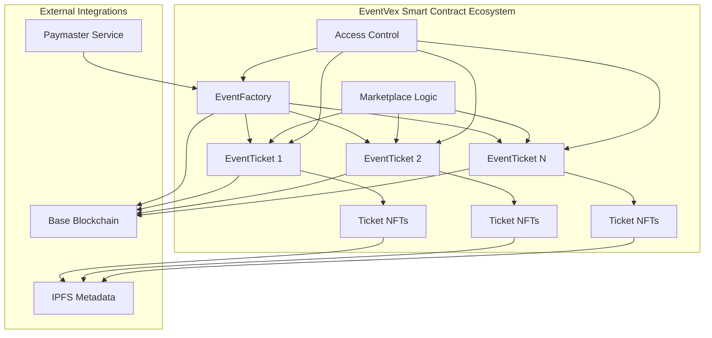
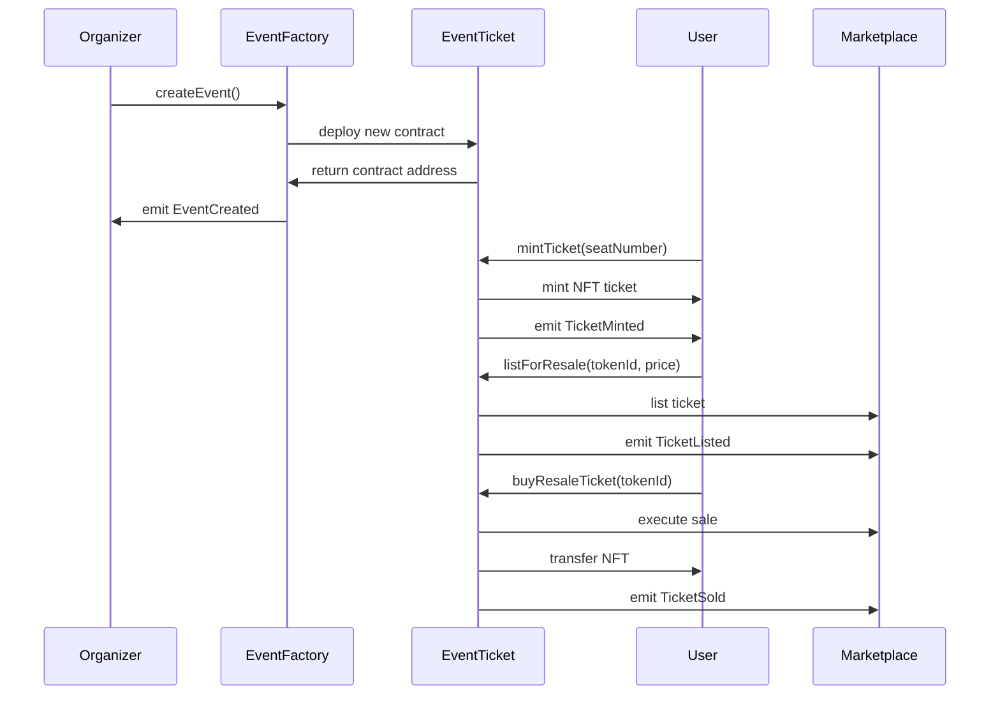
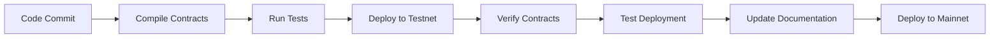

# 🔗 EventVex Web3 Integration

> **Comprehensive guide to EventVex blockchain integration, smart contracts, and Web3 infrastructure**

## 📋 Table of Contents

- [Overview](#overview)
- [Smart Contract Suite](#smart-contract-suite)
- [Development Environment](#development-environment)
- [Deployment Pipeline](#deployment-pipeline)
- [Integration Architecture](#integration-architecture)
- [Security Implementation](#security-implementation)
- [Performance Optimization](#performance-optimization)
- [Troubleshooting](#troubleshooting)

## 🎯 Overview

EventVex's Web3 layer provides the blockchain foundation for decentralized event ticketing. Built on Base blockchain with gasless transactions, mobile wallet support, and comprehensive security measures.

### Key Features

- ✅ **Factory Pattern Smart Contracts** - Scalable event creation
- ✅ **ERC-721 Ticket NFTs** - Unique, transferable tickets
- ✅ **Built-in Resale Marketplace** - Peer-to-peer ticket trading
- ✅ **Gasless Transactions** - EIP-4337 paymaster integration
- ✅ **Mobile Wallet Support** - WalletConnect v2 and in-app wallets
- ✅ **Role-Based Access Control** - Organizer and admin permissions
- ✅ **Automatic Refunds** - Smart contract-based refund system
- ✅ **Platform Revenue** - Configurable fees and royalties

### Network Support

| Network | Chain ID | Status | Purpose |
|---------|----------|--------|---------|
| **Base Sepolia** | 84532 | ✅ Active | Development & Testing |
| **Base Mainnet** | 8453 | 🚧 Ready | Production Deployment |
| **Hardhat Local** | 31337 | ✅ Active | Local Development |

## 🏗️ Smart Contract Suite

### Architecture Overview



### Contract Specifications

#### 1. **EventFactory.sol**
- **Purpose**: Factory for creating and managing events
- **Pattern**: Factory + Registry
- **Gas Cost**: ~2.5M gas for deployment
- **Key Features**:
  - Event creation with validation
  - Organizer role management
  - Platform fee configuration
  - Event discovery and querying

#### 2. **EventTicket.sol**
- **Purpose**: Individual event ticket management
- **Pattern**: ERC-721 + Marketplace + Access Control
- **Gas Cost**: ~3.5M gas per event deployment
- **Key Features**:
  - Ticket minting with seat assignment
  - Built-in resale marketplace
  - Refund mechanism for cancelled events
  - QR code verification system

### Contract Interactions



## 🛠️ Development Environment

### Project Structure

```
web3/
├── contracts/
│   ├── src/
│   │   ├── core/              # Core contracts
│   │   │   ├── EventFactory.sol
│   │   │   └── EventTicket.sol
│   │   ├── interfaces/        # Contract interfaces
│   │   │   ├── IEventFactory.sol
│   │   │   └── IEventTicket.sol
│   │   └── libraries/         # Shared libraries
│   ├── test/                  # Contract tests
│   │   └── EventFactory.test.js
│   └── mocks/                 # Test mocks
├── scripts/
│   ├── deploy/                # Deployment scripts
│   │   └── 01-deploy-core.js
│   ├── verify/                # Verification scripts
│   │   └── verify-contracts.js
│   └── utils/                 # Utility scripts
│       ├── deployment.js
│       ├── verify.js
│       └── test-deployment.js
├── utils/                     # JavaScript utilities
│   ├── blockchain.ts          # Contract interaction helpers
│   ├── walletUtils.js         # Wallet connection utilities
│   └── contractHelpers.js     # Contract helper functions
├── config/
│   ├── networks.js            # Network configurations
│   └── constants.js           # Contract constants
├── deployments/               # Deployment records
├── docs/                      # Contract documentation
└── typechain-types/           # Generated TypeScript types
```

### Development Tools

| Tool | Version | Purpose |
|------|---------|---------|
| **Hardhat** | ^2.19.0 | Development framework |
| **Ethers.js** | ^6.4.0 | Blockchain interaction |
| **OpenZeppelin** | ^5.0.0 | Security libraries |
| **TypeChain** | ^8.3.0 | TypeScript generation |
| **Solhint** | ^4.0.0 | Solidity linting |
| **Hardhat Gas Reporter** | ^1.0.8 | Gas optimization |

### Quick Start Commands

```bash
# Setup environment
cd web3
npm install
cp .env.example .env

# Development workflow
npm run compile          # Compile contracts
npm run test            # Run test suite
npm run test:coverage   # Generate coverage report
npm run lint            # Lint Solidity code
npm run typechain       # Generate TypeScript types

# Deployment workflow
npm run deploy:testnet  # Deploy to Base Sepolia
npm run verify:testnet  # Verify contracts
npm run test:deployment # Test deployed contracts

# Local development
npm run node           # Start local Hardhat node
npm run deploy:local   # Deploy to local network
```

## 🚀 Deployment Pipeline

### Automated Deployment Process



### Deployment Stages

#### 1. **Pre-Deployment Validation**
- ✅ Contract compilation without errors
- ✅ 95%+ test coverage achieved
- ✅ Gas optimization analysis
- ✅ Security audit checklist
- ✅ Environment configuration verified

#### 2. **Testnet Deployment (Base Sepolia)**
- Deploy EventFactory contract
- Verify contract on BaseScan
- Create test event and mint tickets
- Validate all contract functions
- Document gas costs and performance

#### 3. **Production Deployment (Base Mainnet)**
- Final security review
- Multi-signature wallet setup
- Contract deployment with verification
- Platform fee recipient configuration
- Monitoring and alerting setup

### Deployment Configuration

```javascript
// Example deployment configuration
const deploymentConfig = {
  baseSepolia: {
    chainId: 84532,
    rpc: "https://sepolia.base.org",
    platformFeeRecipient: "0x...", // Testnet address
    platformFee: 250, // 2.5%
    organizerRoyalty: 500, // 5%
    gasPrice: "auto",
    confirmations: 5
  },
  baseMainnet: {
    chainId: 8453,
    rpc: "https://mainnet.base.org",
    platformFeeRecipient: "0x...", // Multisig address
    platformFee: 250, // 2.5%
    organizerRoyalty: 500, // 5%
    gasPrice: "auto",
    confirmations: 10
  }
};
```

## 🔌 Integration Architecture

### Frontend Integration Points

#### 1. **Wallet Connection**
```typescript
import { connectWallet, switchToBaseSepolia } from '../utils/walletUtils';

// Connect user wallet
const { address, provider } = await connectWallet();
await switchToBaseSepolia();
```

#### 2. **Contract Interaction**
```typescript
import { createEvent, mintTicket } from '../utils/blockchain';

// Create new event
const { eventId, eventContract } = await createEvent(factoryContract, {
  title: "My Event",
  ticketPrice: "0.01",
  maxTickets: 100
});

// Mint ticket
await mintTicket(eventContract, seatNumber, ticketPrice);
```

#### 3. **Event Listening**
```typescript
// Listen for contract events
eventContract.on('TicketMinted', (tokenId, buyer, seatNumber, price) => {
  updateUI({ tokenId, buyer, seatNumber, price });
});
```

### Mobile Integration

#### Gasless Transactions
- EIP-4337 Account Abstraction
- Paymaster service integration
- Session key management
- Biometric transaction signing

#### Wallet Support
- WalletConnect v2 for mobile wallets
- In-app wallet integration (Privy/Dynamic)
- One-tap wallet connection
- Seamless network switching

## 🔒 Security Implementation

### Security Measures

#### 1. **Smart Contract Security**
- ✅ OpenZeppelin security libraries
- ✅ Reentrancy protection (ReentrancyGuard)
- ✅ Access control (AccessControl)
- ✅ Pausable functionality
- ✅ Input validation and bounds checking
- ✅ Integer overflow protection (Solidity 0.8+)

#### 2. **Access Control Matrix**

| Role | EventFactory | EventTicket | Permissions |
|------|-------------|-------------|-------------|
| **Admin** | Full control | Emergency pause | Platform configuration |
| **Organizer** | Create events | Manage own events | Event lifecycle management |
| **Verifier** | Read-only | Mark tickets used | QR code verification |
| **User** | Read-only | Buy/sell tickets | Ticket transactions |

#### 3. **Economic Security**
- Platform fee limits (max 10%)
- Resale price caps (configurable)
- Refund mechanisms for cancelled events
- Revenue distribution automation

### Security Audit Checklist

- [ ] **Contract Logic Review** - Business logic validation
- [ ] **Access Control Audit** - Permission verification
- [ ] **Economic Model Review** - Tokenomics validation
- [ ] **Integration Testing** - End-to-end security testing
- [ ] **Gas Optimization Review** - DoS attack prevention
- [ ] **Upgrade Safety** - Migration security analysis

## ⚡ Performance Optimization

### Gas Optimization

#### Contract Optimizations
- Efficient data structures (mappings vs arrays)
- Batch operations where possible
- Storage vs memory optimization
- Function visibility optimization

#### Transaction Optimization
- Gas estimation with 20% buffer
- Dynamic gas pricing
- Transaction retry logic
- Failed transaction handling

### Performance Metrics

| Operation | Gas Cost | Optimization |
|-----------|----------|--------------|
| **Event Creation** | ~500K gas | Factory pattern |
| **Ticket Minting** | ~200K gas | Optimized storage |
| **Resale Transaction** | ~250K gas | Direct transfers |
| **Batch Operations** | ~150K per item | Reduced overhead |

## 🔧 Troubleshooting

### Common Issues

#### 1. **Deployment Failures**
```bash
# Check network connectivity
npm run test:network

# Verify gas settings
npm run estimate:gas

# Check account balance
npm run check:balance
```

#### 2. **Transaction Failures**
- Insufficient gas limit
- Network congestion
- Invalid parameters
- Contract state conflicts

#### 3. **Integration Issues**
- Wallet connection problems
- Network mismatch
- ABI version conflicts
- Event listener setup

### Debug Tools

```bash
# Contract debugging
npm run debug:contracts

# Transaction analysis
npm run analyze:tx <hash>

# Gas profiling
npm run profile:gas

# Network diagnostics
npm run diagnose:network
```

## 🔗 Related Documentation

- [Smart Contract API Reference](./smart-contracts.md)
- [Deployment Guide](./deployment.md)
- [Testing Guide](./testing.md)
- [Security Audit](./security.md)
- [Frontend Integration](../frontend/wallet-integration.md)

---

**Next**: [Smart Contract API Reference](./smart-contracts.md) →
