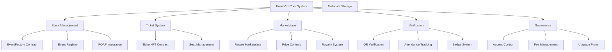
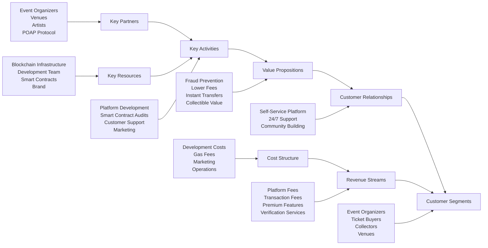

I'll analyze your platform from multiple perspectives to help you design the smart contract architecture. Let me first explore the codebase to understand the current platform structure.

Now I have a comprehensive understanding of the EventVex platform. Let me provide you with a detailed analysis from multiple perspectives:

# 🎟️ EventVex Platform: Comprehensive Analysis

## 🏗️ Systems Designer Perspective

### **Current Architecture Overview**
EventVex is a decentralized event ticketing platform built on Base blockchain with the following architecture:

**Frontend Layer:**
- **Technology Stack**: React 18 + Vite, TypeScript, TailwindCSS
- **State Management**: Local component state (no global state management like Redux/Zustand)
- **Routing**: React Router v6 with client-side routing
- **UI Framework**: Custom components with Lucide icons, Chakra UI, Material-UI
- **Blockchain Integration**: Ethers.js v6 for Web3 interactions

**Blockchain Layer:**
- **Network**: Base Mainnet (Ethereum L2)
- **Smart Contract**: ERC-721 based ticket system
- **Wallet Integration**: MetaMask with Base network switching

**Key Components:**
1. **Event Management**: Create, list, and manage events
2. **Ticket System**: NFT-based tickets with seat assignments
3. **Resale Marketplace**: Secondary market for ticket trading
4. **QR Verification**: Blockchain-verified ticket authentication
5. **POAP Integration**: Proof of Attendance Protocol support
6. **AI Assistant**: Chatbot for user guidance

### **Recommended Smart Contract Architecture**



## 💻 Smart Contract Developer Perspective

### **Current Contract Analysis**

````solidity path=frontend/src/contracts/Ticket.sol mode=EXCERPT
contract Ticket is ERC721 {
    address public owner;
    uint256 public totalOccassions;
    uint256 public totalSupply;

    struct Occassion {
        uint256 id;
        string title;
        uint256 price;
        uint256 tickets;
        uint256 maxTickets;
        string date;
        string time;
        string location;
        uint256 maxResalePrice;
    }
````

### **Recommended Smart Contract Suite**

#### 1. **Core Contracts Architecture**

```solidity
// 1. EventFactory.sol - Factory pattern for event creation
contract EventFactory {
    mapping(uint256 => address) public events;
    uint256 public eventCounter;
    
    function createEvent(
        string memory name,
        uint256 ticketPrice,
        uint256 maxTickets,
        uint256 eventDate,
        string memory venue
    ) external returns (address eventContract);
}

// 2. EventTicket.sol - Individual event contract
contract EventTicket is ERC721, ReentrancyGuard, Pausable {
    struct TicketInfo {
        uint256 seatNumber;
        uint256 purchasePrice;
        uint256 purchaseTime;
        bool isUsed;
        bool isForResale;
        uint256 resalePrice;
    }
    
    // Enhanced features
    mapping(uint256 => TicketInfo) public tickets;
    mapping(address => bool) public hasAttended;
    
    // Revenue sharing
    uint256 public platformFee = 250; // 2.5%
    uint256 public organizerRoyalty = 500; // 5%
}

// 3. Marketplace.sol - Centralized resale marketplace
contract TicketMarketplace {
    struct Listing {
        address seller;
        address ticketContract;
        uint256 tokenId;
        uint256 price;
        uint256 listingTime;
        bool isActive;
    }
    
    mapping(bytes32 => Listing) public listings;
    
    function listTicket(address ticketContract, uint256 tokenId, uint256 price) external;
    function buyTicket(bytes32 listingId) external payable;
}

// 4. POAPIntegration.sol - POAP and badge system
contract POAPIntegration {
    mapping(address => mapping(uint256 => bool)) public eventAttendance;
    mapping(uint256 => string) public poapMetadata;
    
    function markAttendance(address attendee, uint256 eventId) external;
    function claimPOAP(uint256 eventId) external;
}

// 5. VerificationOracle.sol - QR code and attendance verification
contract VerificationOracle {
    mapping(bytes32 => bool) public verifiedTickets;
    mapping(address => bool) public authorizedVerifiers;
    
    function verifyTicket(
        address ticketContract,
        uint256 tokenId,
        bytes32 qrHash
    ) external returns (bool);
}
```

#### 2. **Security Enhancements**

```solidity
// Access Control
import "@openzeppelin/contracts/access/AccessControl.sol";
import "@openzeppelin/contracts/security/ReentrancyGuard.sol";
import "@openzeppelin/contracts/security/Pausable.sol";
import "@openzeppelin/contracts/proxy/utils/Upgradeable.sol";

// Price Oracle Integration
interface IPriceOracle {
    function getETHPrice() external view returns (uint256);
}

// Anti-bot measures
modifier antiBot() {
    require(tx.origin == msg.sender, "No contract calls");
    require(block.timestamp > lastPurchase[msg.sender] + 1 minutes, "Cooldown period");
    _;
}
```

#### 3. **Gas Optimization Strategies**

```solidity
// Batch operations
function batchMint(
    uint256[] calldata seatNumbers,
    address[] calldata recipients
) external onlyOwner {
    require(seatNumbers.length == recipients.length, "Array length mismatch");
    
    for (uint256 i = 0; i < seatNumbers.length; i++) {
        _mint(recipients[i], seatNumbers[i]);
    }
}

// Packed structs for storage efficiency
struct PackedTicketInfo {
    uint128 seatNumber;    // Sufficient for most venues
    uint128 purchasePrice; // Packed to single slot
    uint64 purchaseTime;   // Unix timestamp
    bool isUsed;
    bool isForResale;
}
```

## 💼 Business Analyst Perspective

### **Revenue Model Analysis**

#### **Primary Revenue Streams:**
1. **Platform Fees**: 2-5% on primary ticket sales
2. **Marketplace Fees**: 2.5-10% on secondary sales
3. **Premium Features**: 
   - Advanced analytics for organizers
   - Custom branding options
   - Priority customer support
4. **POAP/Badge Services**: Premium collectible creation
5. **Verification Services**: Enterprise QR verification tools

#### **Market Opportunity:**
- **Global Event Ticketing Market**: $68B+ (2024)
- **Blockchain Ticketing Segment**: $1.4B+ (projected 2028)
- **Target Markets**: 
  - Concerts & Music Festivals
  - Sports Events
  - Corporate Events
  - Art Exhibitions
  - Gaming Tournaments

### **Competitive Advantages:**
1. **Base Integration**: Lower gas fees vs Ethereum mainnet
2. **Anti-Fraud**: Blockchain immutability prevents counterfeiting
3. **Transparent Resale**: Controlled secondary market with price caps
4. **POAP Integration**: Additional value for attendees
5. **QR Verification**: Instant, tamper-proof validation

### **Business Model Canvas:**



### **Implementation Roadmap:**

#### **Phase 1: Core Platform (Months 1-3)**
- [ ] Deploy enhanced smart contract suite
- [ ] Implement comprehensive testing
- [ ] Launch MVP with basic features
- [ ] Onboard initial event organizers

#### **Phase 2: Advanced Features (Months 4-6)**
- [ ] POAP integration
- [ ] Advanced marketplace features
- [ ] Mobile app development
- [ ] Analytics dashboard

#### **Phase 3: Scale & Optimize (Months 7-12)**
- [ ] Multi-chain support (Polygon, Arbitrum)
- [ ] Enterprise features
- [ ] API for third-party integrations
- [ ] Advanced fraud detection

### **Key Metrics to Track:**
1. **Platform Metrics**:
   - Total events created
   - Total tickets sold
   - Transaction volume (ETH)
   - User acquisition cost

2. **Business Metrics**:
   - Monthly recurring revenue
   - Customer lifetime value
   - Churn rate
   - Market share

3. **Technical Metrics**:
   - Smart contract gas efficiency
   - Platform uptime
   - Transaction success rate
   - Security incidents

### **Risk Assessment:**
1. **Technical Risks**: Smart contract vulnerabilities, gas price volatility
2. **Market Risks**: Regulatory changes, competition from traditional platforms
3. **Adoption Risks**: User education, wallet onboarding friction
4. **Operational Risks**: Scalability challenges, customer support demands

### **Recommended Next Steps:**
1. **Smart Contract Audit**: Engage professional auditors
2. **Legal Compliance**: Ensure regulatory compliance in target markets
3. **Partnership Strategy**: Build relationships with major event organizers
4. **User Experience**: Simplify wallet onboarding and transaction flows
5. **Marketing Strategy**: Focus on fraud prevention and cost savings messaging

This comprehensive analysis provides a solid foundation for developing a robust, scalable, and profitable blockchain-based event ticketing platform. The modular smart contract architecture ensures security and upgradability, while the business model focuses on sustainable revenue generation and market penetration.


# 🎟️ EventVex Platform: Comprehensive Implementation Analysis

## 📋 Project Overview & Vision

EventVex (also referred to as Eventverse in documentation) is envisioned as a revolutionary blockchain-based event ticketing platform that aims to eliminate fraud, reduce costs, and enhance user experience through decentralized technology. The platform leverages Base blockchain (Ethereum L2) to provide secure, transparent, and cost-effective ticketing solutions.

## 🏗️ Current Project Structure Analysis

### **Root Directory Structure**
```
eventvex/
├── frontend/                    # Main React application
├── artifacts/                   # Compiled smart contract artifacts
├── cache/                      # Hardhat compilation cache
├── README.md                   # Project documentation
├── about.md                    # Additional project info
├── EventVerse_Pitch_Deck.pdf   # Business presentation
└── package-lock.json           # Root dependency lock (minimal)
```

### **Frontend Directory Deep Dive**
```
frontend/
├── src/
│   ├── components/             # Reusable UI components
│   ├── pages/                  # Route-based page components
│   ├── utils/                  # Utility functions
│   ├── contracts/              # Smart contract files
│   ├── assets/                 # Static assets
│   ├── app/                    # Next.js app directory (unused)
│   ├── main.jsx               # Application entry point
│   ├── Layout.jsx             # Main layout wrapper
│   └── index.css              # Global styles
├── public/                     # Static public assets
├── package.json               # Dependencies and scripts
├── vite.config.js             # Vite configuration
├── tailwind.config.js         # Tailwind CSS configuration
├── tsconfig.json              # TypeScript configuration
├── next.config.mjs            # Next.js config (unused)
└── postcss.config.js          # PostCSS configuration
```

## 🔍 Implementation Status Analysis

### ✅ **FULLY IMPLEMENTED FEATURES**

#### **1. Frontend Infrastructure**
- **React 18 Application**: Complete setup with Vite bundler
- **TypeScript Support**: Configured but not consistently used
- **Styling System**: TailwindCSS with custom theme
- **Routing System**: React Router v6 with comprehensive route structure

````javascript path=frontend/src/main.jsx mode=EXCERPT
const router = createBrowserRouter([
  { path: "/", element: <Layout><Home /></Layout> },
  { path: "discover", element: <Layout><Discover /></Layout> },
  { path: "create", element: <Layout><CreateEvent /></Layout> },
  { path: "resell", element: <Layout><QuantumTicketResale /></Layout> },
  // ... 15+ routes total
]);
````

#### **2. Wallet Integration**
- **MetaMask Connection**: Complete wallet connection system
- **Base Network Support**: Automatic network switching
- **Multi-network Configuration**: Base Mainnet and Sepolia testnet

````javascript path=frontend/src/utils/walletUtils.js mode=EXCERPT
export const connectWallet = async (networkParams = DEFAULT_NETWORK_PARAMS) => {
  // Request account access from MetaMask
  const accounts = await window.ethereum.request({ method: 'eth_requestAccounts' });
  // Create ethers provider and signer
  const provider = new ethers.BrowserProvider(window.ethereum);
  const signer = await provider.getSigner();
  return { address, provider, signer };
};
````

#### **3. Smart Contract Foundation**
- **ERC-721 Based Ticket Contract**: Core ticketing functionality
- **Event Management**: Create and list events
- **Seat Assignment System**: Individual seat tracking
- **Resale Marketplace**: Secondary market functionality

#### **4. UI Components**
- **Responsive Design**: Mobile-first approach with Tailwind
- **Theme System**: Dark/light mode toggle
- **Component Library**: Custom components with consistent styling
- **Navigation**: Header with wallet connection status

### 🔄 **PARTIALLY IMPLEMENTED FEATURES**

#### **1. Event Creation System**
**Status**: 70% Complete
- ✅ **Frontend Form**: Complete event creation UI
- ✅ **Basic Validation**: Form validation implemented
- ⚠️ **Smart Contract Integration**: Partially connected
- ❌ **Image Upload**: Not implemented
- ❌ **Event Categories**: Missing categorization

````javascript path=frontend/src/pages/CreateEvent.jsx mode=EXCERPT
const handleSubmit = async (e) => {
  // Convert price to wei
  const priceInWei = ethers.parseEther(eventData.ticketPrice);
  // Send transaction to blockchain
  const tx = await contract.createEvent(
    eventData.name, eventData.date, eventData.venue,
    priceInWei, eventData.totalTickets
  );
  // MISSING: Error handling, loading states, success feedback
};
````

#### **2. POAP Integration**
**Status**: 30% Complete
- ✅ **Frontend UI**: POAP creation form exists
- ✅ **Data Structure**: POAP data models defined
- ❌ **API Integration**: No actual POAP protocol connection
- ❌ **Metadata Storage**: IPFS integration missing
- ❌ **Minting Logic**: Smart contract integration incomplete

#### **3. QR Code System**
**Status**: 60% Complete
- ✅ **QR Generation**: Basic QR code creation
- ✅ **Visual Interface**: QR display component
- ⚠️ **Verification Logic**: Mock implementation only
- ❌ **Real-time Validation**: No blockchain verification
- ❌ **Attendance Tracking**: Not connected to smart contracts

#### **4. Ticket Resale Marketplace**
**Status**: 50% Complete
- ✅ **Frontend Interface**: Resale listing UI
- ✅ **Price Setting**: Resale price configuration
- ⚠️ **Smart Contract**: Basic resale functions exist
- ❌ **Price Controls**: Max resale price enforcement incomplete
- ❌ **Royalty System**: Creator royalties not implemented

### ❌ **NOT IMPLEMENTED / MISSING FEATURES**

#### **1. Backend Infrastructure**
- **API Server**: No backend server implementation
- **Database**: No persistent data storage
- **User Authentication**: No user account system
- **Admin Panel**: No administrative interface
- **Analytics**: No event/sales analytics

#### **2. Advanced Smart Contract Features**
- **Access Control**: No role-based permissions
- **Upgradeable Contracts**: No proxy pattern implementation
- **Batch Operations**: No bulk ticket operations
- **Emergency Controls**: No pause/emergency stop functionality
- **Gas Optimization**: Contracts not optimized for gas efficiency

#### **3. Security Features**
- **Smart Contract Audits**: No professional security audits
- **Rate Limiting**: No anti-bot protection
- **Input Validation**: Minimal smart contract input validation
- **Reentrancy Protection**: Basic protection only

#### **4. Business Logic**
- **Payment Processing**: No fiat payment integration
- **Refund System**: No ticket refund mechanism
- **Event Management**: No event lifecycle management
- **Organizer Dashboard**: No comprehensive organizer tools

#### **5. Integration Features**
- **IPFS Storage**: No decentralized metadata storage
- **Oracle Integration**: No price feeds or external data
- **Multi-chain Support**: Only Base blockchain supported
- **Third-party APIs**: No external service integrations

## 📦 Dependencies Analysis

### **Production Dependencies**

````json path=frontend/package.json mode=EXCERPT
"dependencies": {
  "@chakra-ui/react": "^3.3.3",        // UI component library
  "@emotion/react": "^11.14.0",        // CSS-in-JS for Chakra
  "@emotion/styled": "^11.14.0",       // Styled components
  "@ethersproject/providers": "^5.7.2", // Ethereum providers
  "@headlessui/react": "^2.2.0",       // Unstyled UI components
  "@heroicons/react": "^2.2.0",        // Icon library
  "@metamask/detect-provider": "^2.0.0", // MetaMask detection
  "@mui/material": "^6.4.0",           // Material-UI components
  "ethers": "^6.13.5",                 // Ethereum library
  "framer-motion": "^11.18.0",         // Animation library
  "lucide-react": "^0.471.1",          // Icon library
  "react": "^18.3.1",                  // Core React
  "react-dom": "^18.3.1",              // React DOM
  "react-router-dom": "^6.28.1",       // Client-side routing
  "react-qr-code": "^2.0.15",          // QR code generation
  "react-toastify": "^11.0.3",         // Toast notifications
  "typescript": "^5.7.3"               // TypeScript support
}
````

### **Development Dependencies**
```json
"devDependencies": {
  "@vitejs/plugin-react": "^4.3.4",    // Vite React plugin
  "autoprefixer": "^10.4.20",          // CSS autoprefixer
  "eslint": "^9.17.0",                 // Code linting
  "postcss": "^8.5.1",                 // CSS processing
  "tailwindcss": "^3.4.17",            // Utility-first CSS
  "vite": "^6.0.5"                     // Build tool
}
```

### **Missing Critical Dependencies**
```json
// Blockchain Development
"@openzeppelin/contracts": "^4.9.0",   // Security standards
"hardhat": "^2.19.0",                  // Development environment
"@nomiclabs/hardhat-ethers": "^2.2.0", // Hardhat-Ethers integration

// Testing
"@testing-library/react": "^13.4.0",   // React testing
"jest": "^29.0.0",                     // Test runner
"cypress": "^12.0.0",                  // E2E testing

// State Management
"zustand": "^4.4.0",                   // State management
// or "redux": "^4.2.0",               // Alternative state management

// Backend Integration
"axios": "^1.6.0",                     // HTTP client
"@tanstack/react-query": "^4.0.0",     // Server state management

// IPFS Integration
"ipfs-http-client": "^60.0.0",         // IPFS client
"pinata-sdk": "^2.1.0",                // IPFS pinning service

// Enhanced UI
"react-hook-form": "^7.47.0",          // Form management
"zod": "^3.22.0",                      // Schema validation
"date-fns": "^2.30.0",                 // Date utilities

// Development Tools
"husky": "^8.0.0",                     // Git hooks
"lint-staged": "^15.0.0",              // Staged file linting
"prettier": "^3.0.0",                  // Code formatting
```

## 🛣️ Routing System Analysis

### **Current Route Structure**
The application uses React Router v6 with a comprehensive routing system:

````javascript path=frontend/src/main.jsx mode=EXCERPT
const router = createBrowserRouter([
  { path: "/", element: <Layout><Home /></Layout> },
  { path: "discover", element: <Layout><Discover /></Layout> },
  { path: "testimonials", element: <Layout><Testimonials /></Layout> },
  { path: "qrcode", element: <Layout><Qrcode /></Layout> },
  { path: "ticket", element: <Layout><Ticket /></Layout> },
  { path: "collection", element: <Layout><Collection /></Layout> },
  { path: "teams", element: <Layout><Teams /></Layout> },
  { path: "ticketsell", element: <Layout><Ticketsell /></Layout> },
  { path: "hero", element: <Layout><Hero /></Layout> },
  { path: "event", element: <Layout><EventList /></Layout> },
  { path: "event-details", element: <Layout><EventDetails /></Layout> },
  { path: "create", element: <Layout><CreateEvent /></Layout> },
  { path: "waiting", element: <Layout><WaitlistPage /></Layout> },
  { path: "resell", element: <Layout><QuantumTicketResale /></Layout> },
  { path: "event/:eventId/tickets", element: <Layout><EventTicketListing /></Layout> },
  { path: "ticket-purchase", element: <Layout><TicketPurchasePage /></Layout> },
  { path: "*", element: <Footer /> }
]);
````

### **Route Analysis & Issues**

#### **✅ Well-Implemented Routes**
- **Home (`/`)**: Complete landing page with features showcase
- **Create (`/create`)**: Event creation with form validation
- **Resell (`/resell`)**: Ticket resale marketplace interface

#### **⚠️ Partially Implemented Routes**
- **QR Code (`/qrcode`)**: UI exists but verification logic incomplete
- **Event Details (`/event-details`)**: Static content, no dynamic data
- **Ticket Purchase (`/ticket-purchase`)**: Mock implementation

#### **❌ Problematic Routes**
- **Collection (`/collection`)**: No actual NFT collection display
- **Event Listing (`/event`)**: No real event data integration
- **Ticket (`/ticket`)**: Unclear purpose and implementation

### **Missing Route Structure**
```javascript
// Recommended additional routes
const enhancedRoutes = [
  // User Management
  { path: "/profile", element: <UserProfile /> },
  { path: "/my-tickets", element: <MyTickets /> },
  { path: "/my-events", element: <MyEvents /> },
  
  // Event Management
  { path: "/events", element: <EventBrowser /> },
  { path: "/events/:eventId", element: <EventDetails /> },
  { path: "/events/:eventId/manage", element: <EventManagement /> },
  
  // Marketplace
  { path: "/marketplace", element: <TicketMarketplace /> },
  { path: "/marketplace/:ticketId", element: <TicketDetails /> },
  
  // Admin
  { path: "/admin", element: <AdminDashboard /> },
  { path: "/admin/events", element: <AdminEvents /> },
  { path: "/admin/users", element: <AdminUsers /> },
  
  // Legal & Support
  { path: "/terms", element: <TermsOfService /> },
  { path: "/privacy", element: <PrivacyPolicy /> },
  { path: "/support", element: <Support /> },
  
  // Authentication
  { path: "/login", element: <Login /> },
  { path: "/register", element: <Register /> }
];
```

## 🔗 Blockchain Layer Requirements

### **Current Smart Contract Implementation**

````solidity path=frontend/src/contracts/Ticket.sol mode=EXCERPT
contract Ticket is ERC721 {
    address public owner;
    uint256 public totalOccassions;
    uint256 public totalSupply;

    struct Occassion {
        uint256 id;
        string title;
        uint256 price;
        uint256 tickets;
        uint256 maxTickets;
        string date;
        string time;
        string location;
        uint256 maxResalePrice;
    }
    
    // Basic functionality exists but needs enhancement
}
````

### **Missing Blockchain Infrastructure**

#### **1. Development Environment**
```bash
# Missing Hardhat setup
npm install --save-dev hardhat
npm install --save-dev @nomiclabs/hardhat-ethers
npm install --save-dev @nomiclabs/hardhat-waffle
npm install --save-dev @openzeppelin/contracts

# Required hardhat.config.js
module.exports = {
  solidity: "0.8.19",
  networks: {
    base: {
      url: "https://mainnet.base.org",
      accounts: [process.env.PRIVATE_KEY]
    },
    baseSepolia: {
      url: "https://sepolia.base.org",
      accounts: [process.env.PRIVATE_KEY]
    }
  }
};
```

#### **2. Enhanced Smart Contract Suite**
```solidity
// Missing contracts that need implementation:

// 1. EventFactory.sol - Factory pattern for events
contract EventFactory {
    event EventCreated(uint256 indexed eventId, address indexed creator, address eventContract);
    
    function createEvent(
        string memory name,
        uint256 ticketPrice,
        uint256 maxTickets,
        uint256 eventDate
    ) external returns (address);
}

// 2. Marketplace.sol - Centralized marketplace
contract TicketMarketplace {
    struct Listing {
        address seller;
        address ticketContract;
        uint256 tokenId;
        uint256 price;
        bool active;
    }
    
    function listTicket(address ticketContract, uint256 tokenId, uint256 price) external;
    function buyTicket(bytes32 listingId) external payable;
}

// 3. POAPIntegration.sol - POAP functionality
contract POAPIntegration {
    mapping(uint256 => string) public eventPOAPs;
    mapping(address => mapping(uint256 => bool)) public claimed;
    
    function createPOAP(uint256 eventId, string memory metadataURI) external;
    function claimPOAP(uint256 eventId) external;
}

// 4. VerificationOracle.sol - QR verification
contract VerificationOracle {
    mapping(bytes32 => bool) public verifiedTickets;
    
    function verifyTicket(
        address ticketContract,
        uint256 tokenId,
        bytes32 qrHash
    ) external returns (bool);
}
```

#### **3. Testing Infrastructure**
```javascript
// Missing test files structure:
test/
├── unit/
│   ├── Ticket.test.js
│   ├── EventFactory.test.js
│   ├── Marketplace.test.js
│   └── POAPIntegration.test.js
├── integration/
│   ├── FullWorkflow.test.js
│   └── MarketplaceIntegration.test.js
└── fixtures/
    ├── events.js
    └── tickets.js

// Example test structure needed:
describe("Ticket Contract", function() {
  it("Should mint tickets correctly", async function() {
    // Test implementation
  });
  
  it("Should handle resales properly", async function() {
    // Test implementation
  });
});
```

## 🏗️ Project Management & Development Workflow

### **Current Development Issues**

#### **1. Inconsistent Technology Stack**
- **Mixed Frameworks**: Both React and Next.js configurations present
- **TypeScript Adoption**: Partial TypeScript usage (`.jsx` and `.tsx` files mixed)
- **Styling Conflicts**: Multiple UI libraries (Chakra, Material-UI, Tailwind)

#### **2. Code Organization Problems**
- **Component Structure**: No clear component hierarchy
- **State Management**: No centralized state management
- **Error Handling**: Inconsistent error handling patterns
- **Loading States**: Missing loading indicators

#### **3. Development Workflow Gaps**
- **No CI/CD**: Missing automated testing and deployment
- **No Code Quality Tools**: Missing ESLint configuration, Prettier
- **No Git Hooks**: No pre-commit hooks for code quality
- **No Documentation**: Missing component documentation

### **Recommended Project Structure**

```
eventvex/
├── contracts/                  # Smart contracts
│   ├── src/
│   │   ├── core/              # Core contracts
│   │   ├── interfaces/        # Contract interfaces
│   │   ├── libraries/         # Shared libraries
│   │   └── mocks/             # Test mocks
│   ├── test/                  # Contract tests
│   ├── scripts/               # Deployment scripts
│   └── hardhat.config.js      # Hardhat configuration
├── frontend/
│   ├── src/
│   │   ├── components/        # Reusable components
│   │   │   ├── ui/           # Basic UI components
│   │   │   ├── forms/        # Form components
│   │   │   └── layout/       # Layout components
│   │   ├── pages/            # Page components
│   │   ├── hooks/            # Custom React hooks
│   │   ├── store/            # State management
│   │   ├── services/         # API services
│   │   ├── utils/            # Utility functions
│   │   ├── types/            # TypeScript types
│   │   └── constants/        # Application constants
│   ├── public/               # Static assets
│   └── tests/                # Frontend tests
├── backend/                   # Backend API (to be implemented)
│   ├── src/
│   │   ├── controllers/      # API controllers
│   │   ├── services/         # Business logic
│   │   ├── models/           # Data models
│   │   └── middleware/       # Express middleware
│   └── tests/                # Backend tests
├── docs/                     # Documentation
├── scripts/                  # Build and deployment scripts
└── docker/                   # Docker configurations
```

## 📋 Implementation Priority Matrix

### **Phase 1: Foundation (Weeks 1-4)**
**Priority: CRITICAL**

1. **Smart Contract Security**
   - [ ] Implement OpenZeppelin security standards
   - [ ] Add comprehensive access controls
   - [ ] Implement reentrancy protection
   - [ ] Add emergency pause functionality

2. **Development Environment**
   - [ ] Set up Hardhat development environment
   - [ ] Configure proper testing framework
   - [ ] Implement deployment scripts
   - [ ] Set up local blockchain for testing

3. **Code Quality**
   - [ ] Standardize on TypeScript throughout
   - [ ] Implement ESLint and Prettier
   - [ ] Set up pre-commit hooks
   - [ ] Add comprehensive error handling

### **Phase 2: Core Features (Weeks 5-8)**
**Priority: HIGH**

1. **Event Management**
   - [ ] Complete event creation workflow
   - [ ] Implement event browsing and search
   - [ ] Add event categories and tags
   - [ ] Implement event lifecycle management

2. **Ticket System**
   - [ ] Enhance ticket minting process
   - [ ] Implement batch operations
   - [ ] Add ticket metadata storage (IPFS)
   - [ ] Complete QR verification system

3. **User Experience**
   - [ ] Implement proper loading states
   - [ ] Add comprehensive error messages
   - [ ] Improve wallet connection flow
   - [ ] Add transaction status tracking

### **Phase 3: Advanced Features (Weeks 9-12)**
**Priority: MEDIUM**

1. **Marketplace Enhancement**
   - [ ] Implement price controls
   - [ ] Add royalty system
   - [ ] Create advanced filtering
   - [ ] Add marketplace analytics

2. **POAP Integration**
   - [ ] Connect to POAP protocol
   - [ ] Implement metadata storage
   - [ ] Add badge creation system
   - [ ] Create attendance tracking

3. **Analytics & Reporting**
   - [ ] Implement event analytics
   - [ ] Add sales reporting
   - [ ] Create organizer dashboard
   - [ ] Add user activity tracking

### **Phase 4: Scale & Optimize (Weeks 13-16)**
**Priority: LOW**

1. **Performance Optimization**
   - [ ] Optimize smart contract gas usage
   - [ ] Implement caching strategies
   - [ ] Add CDN for static assets
   - [ ] Optimize bundle size

2. **Multi-chain Support**
   - [ ] Add Polygon support
   - [ ] Implement Arbitrum integration
   - [ ] Create chain abstraction layer
   - [ ] Add cross-chain functionality

3. **Enterprise Features**
   - [ ] Add white-label solutions
   - [ ] Implement API for integrations
   - [ ] Create admin panel
   - [ ] Add advanced permissions

## 🔧 Technical Debt & Issues

### **Critical Issues**

1. **Security Vulnerabilities**
   - Smart contracts lack proper access controls
   - No reentrancy protection in payment functions
   - Missing input validation in critical functions
   - No emergency stop mechanisms

2. **Architecture Problems**
   - Monolithic smart contract design
   - No separation of concerns
   - Tight coupling between components
   - No upgrade path for contracts

3. **Data Management**
   - No persistent data storage
   - Client-side only state management
   - No data synchronization between blockchain and UI
   - Missing data validation layers

### **Performance Issues**

1. **Gas Optimization**
   - Inefficient storage patterns
   - No batch operations
   - Redundant blockchain calls
   - Missing gas estimation

2. **Frontend Performance**
   - Large bundle size
   - No code splitting
   - Missing image optimization
   - No caching strategies

### **User Experience Issues**

1. **Wallet Integration**
   - Complex wallet connection flow
   - No wallet state persistence
   - Missing network validation
   - Poor error messages

2. **Transaction Handling**
   - No transaction status tracking
   - Missing loading states
   - No retry mechanisms
   - Poor error recovery

## 🎯 Success Metrics & KPIs

### **Technical Metrics**
- **Smart Contract Security**: 0 critical vulnerabilities
- **Test Coverage**: >90% for smart contracts, >80% for frontend
- **Performance**: <3s page load time, <30s transaction confirmation
- **Uptime**: 99.9% platform availability

### **Business Metrics**
- **User Adoption**: 1000+ active users in first 3 months
- **Transaction Volume**: $100K+ in ticket sales
- **Event Organizers**: 50+ active organizers
- **Platform Revenue**: $10K+ monthly recurring revenue

### **User Experience Metrics**
- **Wallet Connection Success**: >95%
- **Transaction Success Rate**: >98%
- **User Retention**: >60% monthly retention
- **Support Tickets**: <5% of transactions require support

This comprehensive analysis reveals that while EventVex has a solid foundation and vision, significant development work is required to achieve a production-ready, secure, and scalable platform. The focus should be on completing the core blockchain infrastructure, implementing proper security measures, and creating a seamless user experience before expanding to advanced features.
